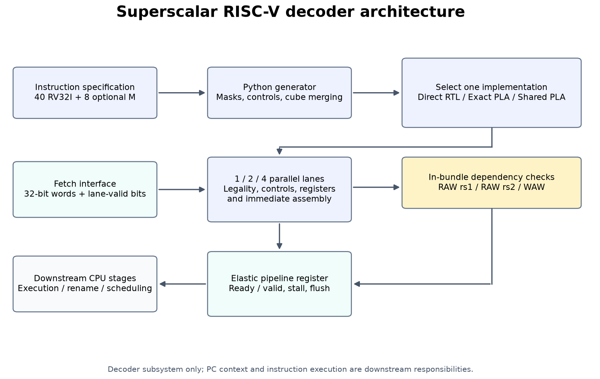
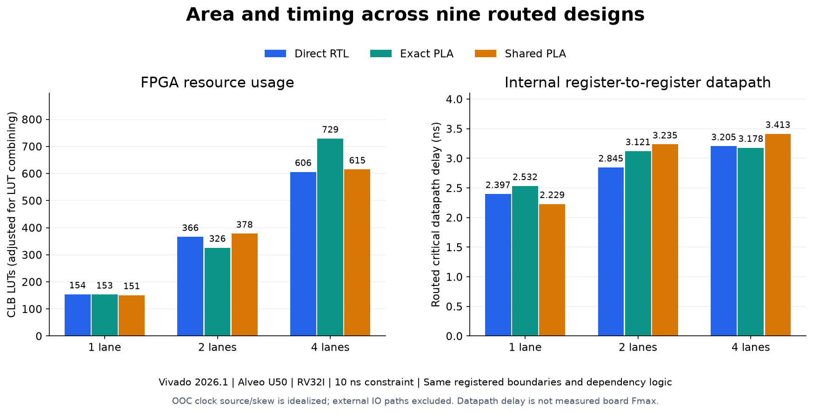

# Superscalar RISC-V PLA decoder

A parameterized 1-, 2-, or 4-lane instruction decoder with generated AND/OR
decode logic, a direct RTL baseline, in-bundle dependency metadata, and a
stallable pipeline stage. Implemented in synthesizable SystemVerilog for Vivado.

See [measured results](RESULTS.md), [design notes](DESIGN.md), and
[verification reports](reports/). All three architectures passed the independent
model regression; all nine routed comparison configurations met their OOC
timing constraints. Clock-model and board-testing limits are documented below.





See the [screenshots and figures gallery](docs/FIGURES.md) for original XSim
PASS logs, all nine benchmark results, the pipeline waveform, and routed
timing/utilization report screenshots. The plots distinguish CLB LUT utilization
from LUT primitive-cell counts.

## Architecture

```
spec/instructions.csv --> tools/generate.py --> direct / exact PLA / shared PLA
                                                   |
32-bit instructions + lane valids --> parallel decode lanes --> decoded controls
                                                   |                |
                                                   +---- RAW/WAW ---+
                                                                    |
                                                        elastic bundle register
```

The instruction specification contains all 40 RV32I instructions and the eight
optional M-extension instructions. `ENABLE_M=0` is the default. Compressed,
CSR, floating-point, atomic, privileged instructions, and FENCE.I are unsupported
and flagged illegal. ECALL and EBREAK are legal decodes with explicit trap
requests. This is a decoder subsystem, not a CPU or an instruction executor.

Three `IMPL` settings provide identical external behavior:

| IMPL | Implementation |
| --- | --- |
| 0 | Generated `casez` direct RTL |
| 1 | One masked-equality product term per instruction; OR equations per control bit |
| 2 | Exact cube merging per control output, then product-term sharing across outputs |

The shared variant uses a bounded exact-combination algorithm, not a claim of
global minimum logic. It can have more distinct terms than the instruction PLA
because different outputs use different simplified cubes. FPGA synthesis can
collapse the three RTL descriptions to similar circuits. Measure the routed
results before claiming a performance or area improvement.

## Interfaces

`superscalar_decoder` accepts `WIDTH` independent valid lanes. Lane 0 occupies
the least-significant instruction slice and is the oldest instruction.
Outputs use the same lane ordering. `decode_pkg::decode_t` is an 89-bit packed
record containing valid/illegal status, operation ID, format, execution unit,
ALU operation, register-use flags, memory controls, trap/serialization metadata,
register numbers, a sign-extended immediate, and the FENCE fm/pred/succ bits.
The generated package defines all IDs and the precise packed field order.

An invalid lane produces all zeros. An illegal valid instruction produces only
`valid=1` and `illegal=1`, with no register or execution side effects. Writes to
x0 are suppressed, including their RAW/WAW participation. Legal hints retain
their ordinary RV32I decoding. FENCE ignores reserved rd/rs1 fields and preserves
fm/pred/succ for the downstream execution unit; conservative execution as a full
fence is possible. No CSR address or privilege checks are performed here.

Dependency bit `younger*WIDTH+older` indicates a RAW dependence on rs1/rs2 or a
WAW conflict. Only older valid legal register writers participate. The metadata
does not stall or rename instructions. A downstream stage must select the
youngest matching producer and enforce branch, trap, and fence ordering.

`decode_pipeline` registers a complete bundle in a one-entry ready/valid buffer.
It supports simultaneous dequeue/enqueue, holds outputs under backpressure,
and clears pending work on synchronous reset or flush. Flush wins over incoming
work and deasserts `in_ready`. There is one clock of latency and a maximum of
one accepted bundle per clock when the consumer is ready.

## Run verification

From PowerShell in this folder:

```powershell
.\scripts\verify.ps1
```

The default tool root is `E:\Vivado\2026.1`. Override it with `-VivadoRoot`.
The script uses Vivado's bundled Python and XSim, with no external Python
packages. Python's Windows Store alias is not required.

The independent opcode-oriented model in `tools/reference.py` does not read
the instruction CSV or the RTL generator. Vectors cover every opcode/funct3/
funct7 combination with representative operands, full 12-bit immediate spaces,
all RV32 shift immediate encodings, exact SYSTEM instructions and bit mutations,
random words, invalid lanes, x0, and dense M-extension register combinations.

The decoder test runs all three architectures at widths 1/2/4 with M both
enabled and disabled, comparing complete output records and dependency matrices
to model results. The pipeline test separately checks reset, flush, bubbles,
backpressure, and replacement against a cycle scoreboard. This is simulation
verification; exhaustive architectural proof of all 2^32 instructions is not
claimed. Passing tests do not establish compliance of an entire RISC-V CPU.

Reports are under `build/`: vector coverage and two simulation JSON reports.

## Run area/timing comparisons

```powershell
& 'E:\Vivado\2026.1\Vivado\bin\vivado.bat' -mode batch -source scripts/synthesize.tcl -tclargs xcu50-fsvh2104-2-e all all
```

This runs nine routed out-of-context designs: widths 1/2/4 times three
architectures, RV32I mode. The target is an Alveo U50 `xcu50-fsvh2104-2-e`,
supported by this installation's Alveo license. This is a reproducible comparison,
not an assumption that you own that board. Substitute
a supported part as the first Tcl argument. Optional second/third arguments
select one width or implementation instead of `all`.

Alternatively, `.\scripts\benchmark.ps1` runs the comparison and updates
`RESULTS.md` automatically. `-Width 4 -Implementation 2` selects just the
four-lane shared PLA.

All variants have the same input/output registers and dependency logic, and a
10 ns clock constraint. External IO paths are excluded; internal
register-to-register paths are timed. This avoids comparing arbitrary IO
placement or unmatched combinational boundaries. The top is `benchmark_top`,
which is a measurement wrapper rather than the ready/valid pipeline.

`build/synthesis/` contains utilization, routed timing, critical-path reports,
checkpoints, and JSON metrics for each run. LUT/flip-flop counts are primitive
cell counts. Timing slack includes setup and clock effects; critical datapath
delay alone is not a demonstrated maximum clock frequency. Run
`tools/summarize.py` with the bundled Python to make a comparison table.

Vivado warns that external ports have no `HD.PARTPIN_LOCS` and the clock has
no `HD.CLK_SRC`. External data paths are intentionally excluded. The OOC clock
model does not establish deployed clock insertion delay/skew; reported slack
is under that model, and routed datapath delay is the main comparison metric.
A board-specific clock/pin implementation would be required to establish
timing of a deployed design.

## Open the project in Vivado

```powershell
& 'E:\Vivado\2026.1\Vivado\bin\vivado.bat' -mode batch -source scripts/create_project.tcl
```

Then open `build/vivado/pla_decoder.xpr`. The synthesis top is `benchmark_top`;
the default simulation top is `tb_decoder`. Set the simulation top to
`tb_pipeline` to examine the elastic interface. `scripts/verify.ps1` is the
recommended full regression because it generates the oracle vector file and
uses a controlled working directory.

Use `scripts/benchmark.ps1` for implementation measurements. The project has
no board pin assignments and is not set up to generate a board bitstream.

## Resume description

Use the measured numbers in `RESULTS.md` after a successful run. A truthful
starting description is:

> Designed a four-lane RISC-V instruction decoder with generated PLA control
> logic, configurable RV32M support, RAW/WAW dependency detection, and an elastic
> pipeline; verified three decode architectures against an independent model
> and compared routed FPGA area and timing at widths 1, 2, and 4.

Hardware board operation, silicon fabrication, whole-CPU performance, formal
proof, and speedup over another processor have not been demonstrated.

## Specification references

- RV32I v2.1: https://docs.riscv.org/reference/isa/v20260120/unpriv/rv32.html
- M extension v2.0: https://docs.riscv.org/reference/isa/v20260120/unpriv/m-st-ext.html
