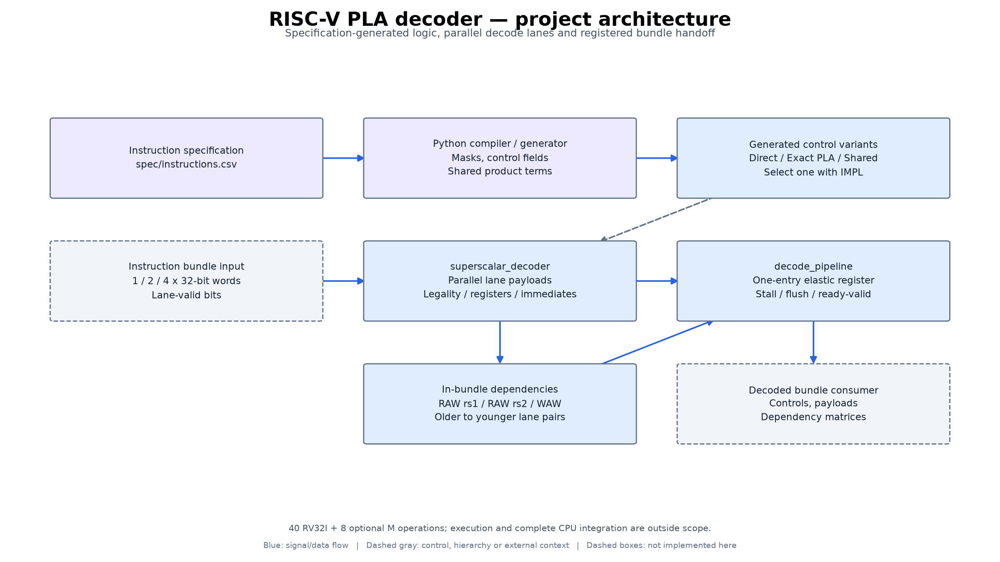
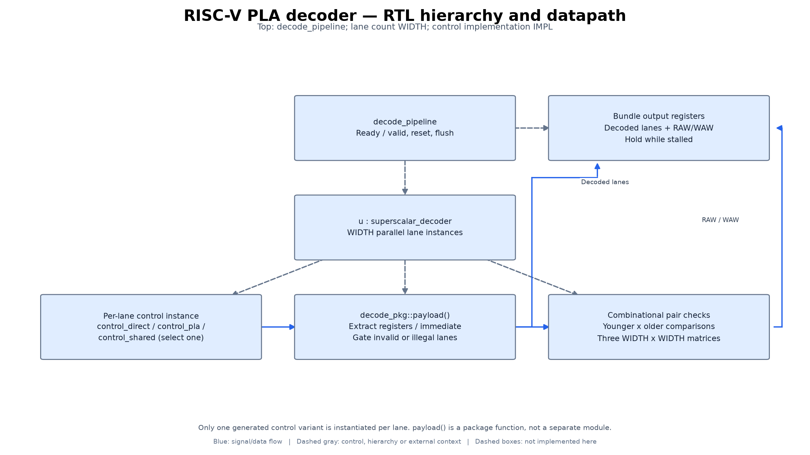
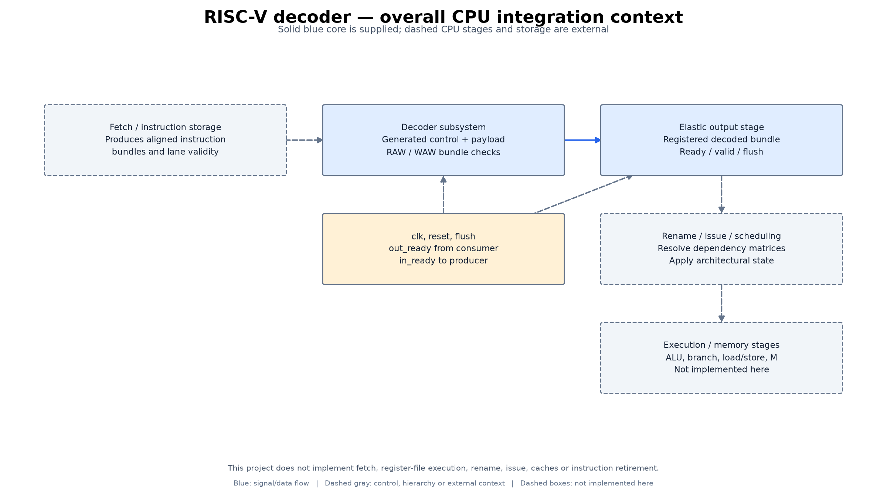

# Architecture and implementation diagrams

RTL decoder subsystem, not a complete CPU. PLA figures are logical structures, not a fabricated physical PLA or synthesized gate schematic.

These diagrams were derived from the source files linked below. They are
annotated engineering block diagrams, not Vivado synthesized-netlist exports,
application screenshots, PCB schematics, or newly validated hardware.

## project architecture

Specification-generated logic, parallel decode lanes and registered bundle handoff.

40 RV32I + 8 optional M operations; execution and complete CPU integration are outside scope.

[Scalable SVG](diagrams/figures/architecture_overview.svg)

## RTL hierarchy and datapath

Top: decode_pipeline; lane count WIDTH; control implementation IMPL.

Only one generated control variant is instantiated per lane. payload() is a package function, not a separate module.

[Scalable SVG](diagrams/figures/rtl_structure.svg)

## overall CPU integration context

Solid blue core is supplied; dashed CPU stages and storage are external.

This project does not implement fetch, register-file execution, rename, issue, caches or instruction retirement.

[Scalable SVG](diagrams/figures/hardware_context.svg)

## Source mapping and reproduction

Dashed boxes are external integration context, not delivered implementations.
Blue arrows show data/signal flow; dashed gray arrows show control, hierarchy,
or external context. Internal responsibility boxes may represent functions or
register groups rather than separately instantiated modules.

Source files:

- [rtl/decode_pipeline.sv](../rtl/decode_pipeline.sv)
- [rtl/superscalar_decoder.sv](../rtl/superscalar_decoder.sv)
- [rtl/generated/decode_pkg.sv](../rtl/generated/decode_pkg.sv)
- [rtl/generated/control_shared.sv](../rtl/generated/control_shared.sv)
- [spec/instructions.csv](../spec/instructions.csv)

Source revision: `334f735b761ee4efedd6b9e1026f24b5fb12328d`. The [provenance manifest](diagrams/provenance.json)
records hashes of the inspected source files. No functional source or existing
simulation results were changed for this documentation update.

To regenerate, install `docs/diagrams/requirements.txt` in a separate Python
environment and run `python docs/diagrams/render.py` from the repository root.
The editable block/connection definitions are in [design.json](diagrams/design.json).
