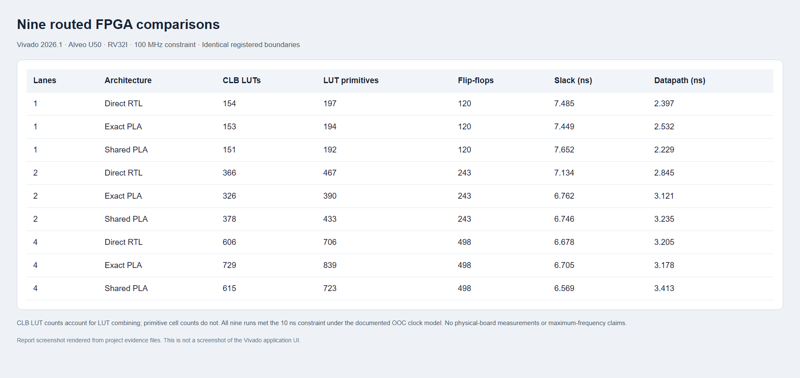
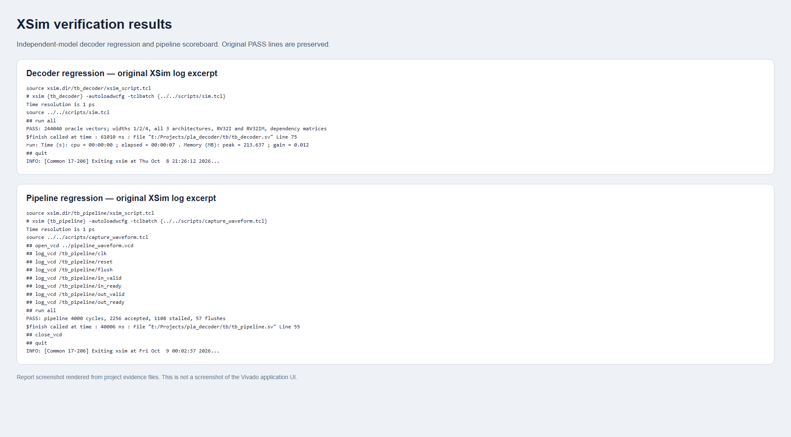
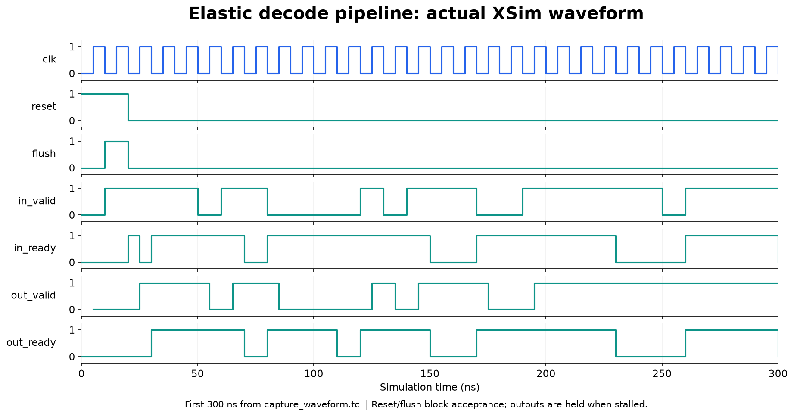
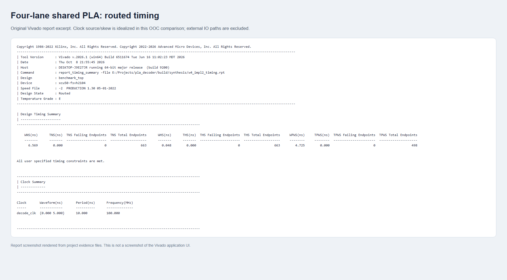
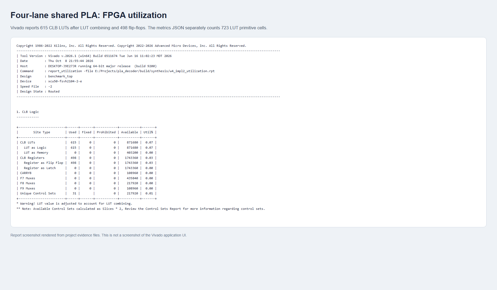

# Results screenshots and engineering figures

These images come from the actual project reports and simulation output.
The report screenshots are browser captures of original report excerpts rendered
in HTML, not screenshots of the Vivado GUI. The waveform is plotted from an
actual XSim VCD capture. PNG files are suitable for viewing; SVG versions of
the engineering figures are available for scaling and export.

## Architecture

## FPGA area and timing

The area plot uses Vivado's **CLB LUT** utilization count, which accounts for
LUT combining. The original JSON metrics separately count **LUT primitive
cells**. For the four-lane shared PLA, those counts are 615 and 723,
respectively; there are 498 flip-flops. Both measures appear in the table below.

Timing comes from routed out-of-context designs with an idealized clock
source/skew model, a 10 ns constraint, and external IO paths excluded. These
are not physical-board measurements or demonstrated maximum clock frequencies.

## Verification evidence

Source excerpts: [decoder log](../reports/evidence/decoder_xsim.txt) and
[pipeline log](../reports/evidence/pipeline_xsim.txt).

## Pipeline handshake waveform

The first 300 ns show reset, flush, acceptance, bubbles, and backpressure.
The full [captured VCD](../reports/evidence/pipeline_waveform.vcd) is included.
Output data stability is checked by the existing pipeline scoreboard; this
figure displays the handshake signals only.

## Original routed report excerpts

Full reports: [timing](../reports/synthesis/w4_impl2_timing.rpt) and
[utilization](../reports/synthesis/w4_impl2_utilization.rpt).

## Reproduce

Install `tools/visualization-requirements.txt` in a separate Python environment,
then run `python tools/visualize.py` from the project root. The script requires
Edge or Chrome on Windows, uses an isolated headless browser profile, and reads
the committed reports and VCD. It does not capture the desktop.

To capture a fresh waveform, first run `scripts/verify.ps1`, then execute XSim
from `build/sim` with `scripts/capture_waveform.tcl`. Copy the resulting
`build/pipeline_waveform.vcd` into `reports/evidence/` before regenerating the
figures. [Provenance](figures/provenance.json) records source hashes and the
measurement rows used in the plots.
